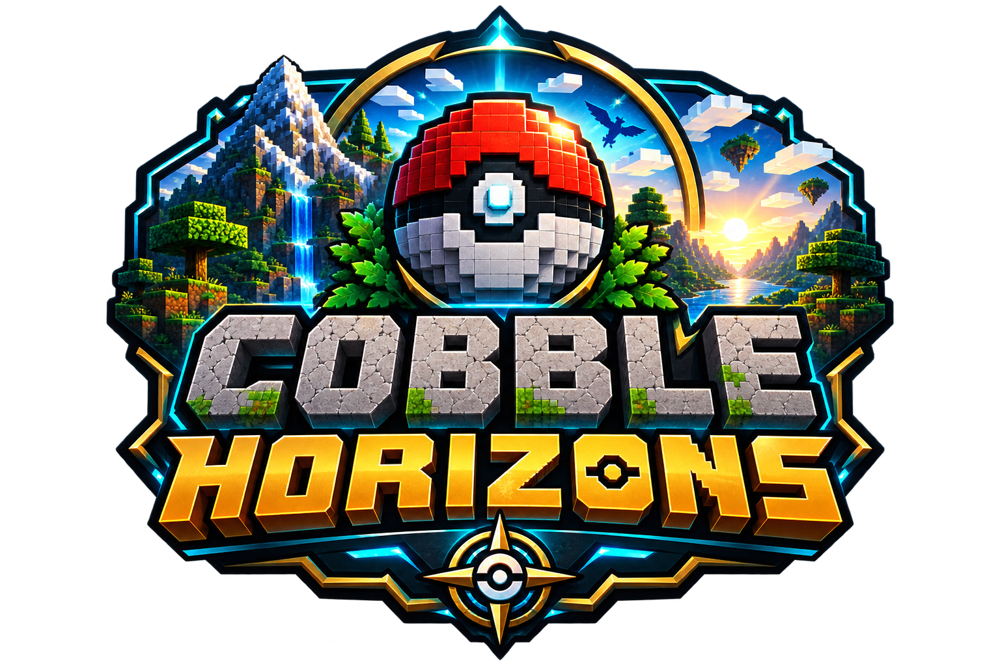
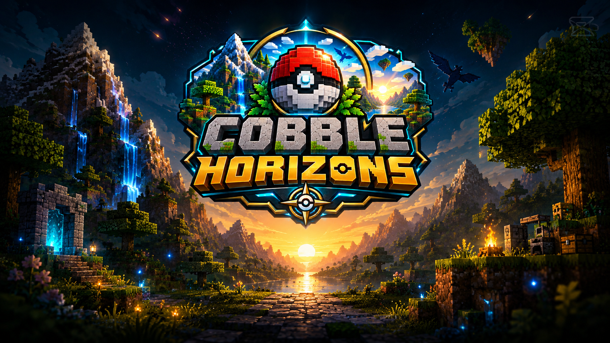
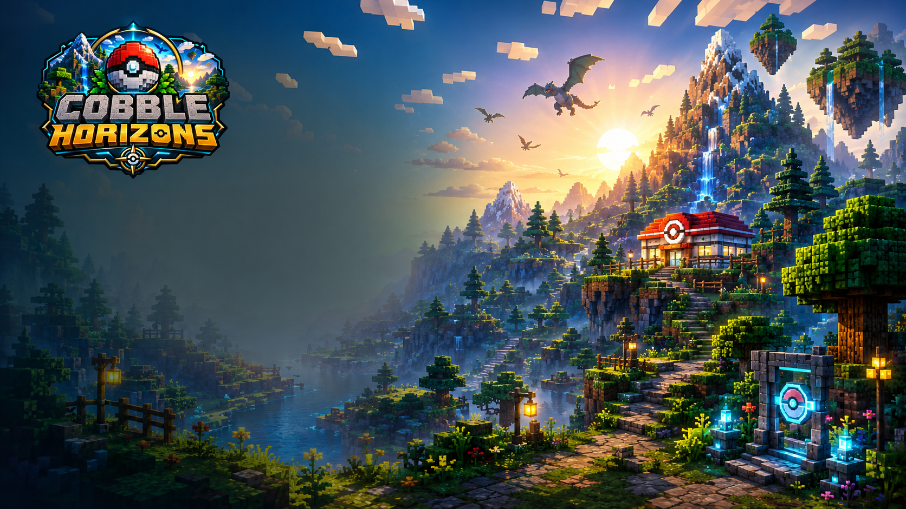

# CobbleHorizons

**Minecraft is the world. Pokémon is the game.**

   

CobbleHorizons é um modpack Fabric para Minecraft 1.21.1 que transforma o Minecraft em uma aventura Pokémon completa. Exploração, captura, treinamento, batalhas, ginásios, progressão e imersão formam uma única experiência.

## Visão

Não é um modpack genérico que apenas contém Pokémon. Cada mod, configuração e resource pack deve contribuir para uma jornada Pokémon em mundo aberto, preservando desempenho, estabilidade e identidade própria.

## Estado atual

| Item | Estado |
|---|---|
| Versão | v0.8.0 — Configuration & Identity |
| Validação | Aguardando teste em instalação limpa |
| Minecraft | 1.21.1 |
| Loader | Fabric 0.19.x |
| Cobblemon | 1.7.3 |
| Próximo marco | v0.9.0 — Release Candidate |

> O MRPack atual é uma exportação de trabalho. Um novo pacote será gerado após a validação dos configs da v0.8.

## Destaques

- exploração, estruturas, treinadores e ginásios;
- Mega Evolution, breeding, TMs/TRs e Pokédex;
- mapas, waystones, economia e qualidade de vida;
- áudio ambiente, battle tracks e shaders opcionais;
- otimizações de renderização, memória e lógica;
- interface própria com logo, wallpapers, ícones e botões.

## Identidade visual

Drippy Loading Screen personaliza o boot. FancyMenu controla o menu principal e os estilos globais das telas compatíveis.

## Como testar a v0.8

1. Importe a base MRPack no Modrinth.
2. Copie os arquivos atuais do repositório para a raiz da instância.
3. Substitua os configs existentes.
4. Execute docs/testing.md.
5. Analise logs/latest.log.
6. Após aprovação, exporte um novo MRPack.

## Documentação

| Documento | Conteúdo |
|---|---|
| docs/installation.md | Instalação e atualização |
| docs/ui-branding.md | Interface e identidade |
| docs/mod-list.md | Mods e versões |
| docs/roadmap.md | Planejamento |
| docs/testing.md | Checklists |
| docs/troubleshooting.md | Diagnóstico |
| CONTRIBUTING.md | Contribuições |
| CHANGELOG.md | Histórico |

## Estrutura

    config/        Configurações distribuídas
    docs/          Documentação
    imgs/          Artes originais
    resourcepacks/ Resource packs
    shaderpacks/   Shaders recomendados

## Créditos e direitos

CobbleHorizons é um projeto independente da comunidade. Minecraft pertence à Mojang Studios/Microsoft. Pokémon pertence à Nintendo, Game Freak e The Pokémon Company. Cobblemon e os demais mods pertencem aos seus respectivos autores.

---

**Explore. Capture. Battle. Build your journey.**

