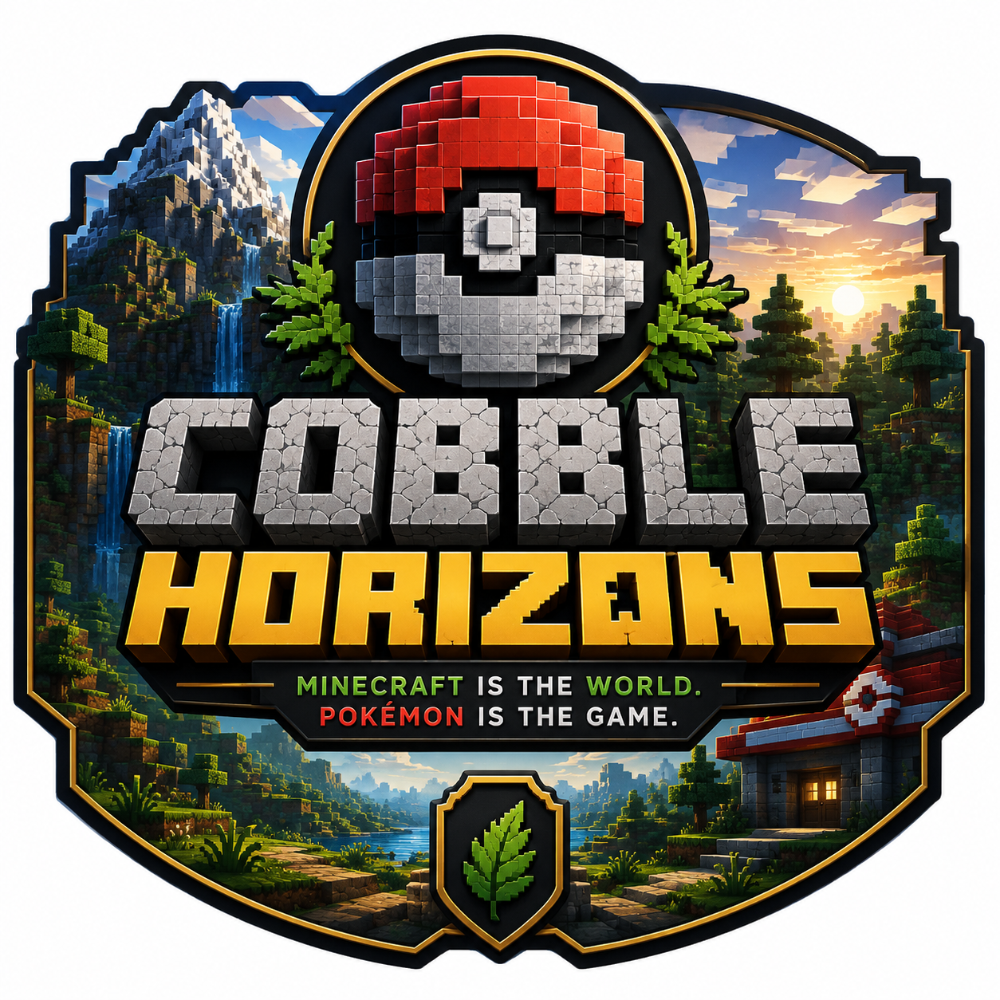

# CobbleHorizons

CobbleHorizons is a Minecraft modpack built around Cobblemon, focused on exploration, Pokémon progression, trainers, gyms, legendary encounters and an immersive Pokémon-inspired world.

> Current Version: v0.6.0  
> Development Stage: Pre-Alpha

---

## Base

- Minecraft 1.21.1
- Fabric
- Cobblemon 1.7.3

---

## Features

CobbleHorizons currently includes:

- Pokémon catching and battling
- Pokémon trainers
- Trainer structures
- Gyms
- Gym badges
- Capture progression
- Mega Evolution
- Pokémon breeding
- IV and EV utilities
- TMs and TRs
- Legendary and mythical Pokémon content
- Legendary monuments
- Pokémon nests and dens
- Expanded Pokémon structures
- Terralith world generation
- Economy system
- Waystone fast travel
- Minimap and world map
- Furniture and decoration
- Environmental ambience
- Pokémon battle music
- Shader support
- Performance optimizations

---

## Graphics

CobbleHorizons supports Iris shaders.

Recommended shader:

**Complementary Shaders - Reimagined**

Shaders are optional and may have a significant performance impact depending on the player's hardware.

---

## Development Status

CobbleHorizons is currently under active development.

Completed milestones:

- v0.1 — Foundation
- v0.2 — World & Exploration
- v0.3 — Trainers & Battles
- v0.4 — Gyms & Progression
- v0.5 — Expanded Pokémon Gameplay
- v0.6 — Immersion & Visuals

Next:

**v0.7 — Balance & Cleanup**

---

## Testing

Development testing currently focuses on singleplayer.

Multiplayer compatibility is not currently guaranteed.

See:

- `docs/testing.md`
- `docs/mod-list.md`
- `docs/roadmap.md`

for detailed development information.

---

## Known Issues

Some non-critical warnings are currently present in development logs.

They do not currently prevent normal gameplay and will be reviewed during the v0.7 cleanup phase.

---

## Disclaimer

CobbleHorizons is an unofficial community project.

Minecraft is a trademark of Mojang Studios.

Pokémon and related properties belong to their respective owners.

Cobblemon is developed by the Cobblemon team and its contributors.